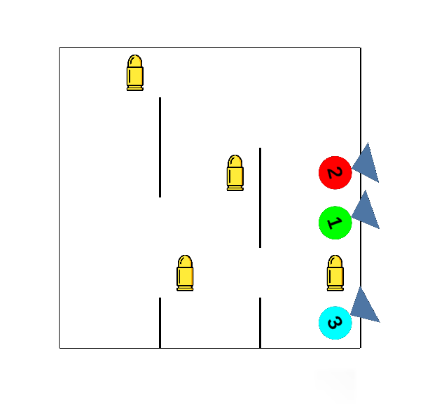

# BattleRoyale
Battle Royale is a fully competitive environment for reinforcement learning. Each agent need to kill another agents using bullets that are scattered in the environment. At the beginning, agents and bullet packs are placed randomly. Every few steps, a fixed number of bullet packs are added into the environment. The environment will stop if only 1 agent exist in the environment.

* The environment has continuous observation and action space.  
* The environment is made using Unity.

## Sample Environment

Note :
* Green circle : normal agent
* Red circle : agressive agent
* Blue circle : passive agent
* Blue triangle : agent's point-of-view
* Black line : wall
* Yellow bullet : bullet pack

## Installation
1. Download Unity [ML-Agents Beta v0.13.1](https://github.com/Unity-Technologies/ml-agents/releases/tag/0.13.1)
2. Go to `ml-agents` directory and type `pip install .`
3. Go to `gym-unity` directory and type `pip install .`
4. Download Battle Royale Environment [release](https://github.com/adhipradhana/BattleRoyale/releases/tag/1.0) for your platform.
5. Battle Royale Environment can be accessed with Unity Gym interface.

## Configurations
Each released files consist of two directory i.e. the environment directory and config directory. Environment directory consists of the executables. Config directory consists of configurable environment and reward system file. Do not rearrange the location of files in the directory. 

The followings are the files in config folder :
1. unity_config.yaml - for environment configuration
2. reward_system_config.yaml - for reward system configuration
3. info.txt - performance data for each agent (shooting accuracy, kill/death ratio, number of win)

### unity_config.yaml file
The followings are enviroment configuration that can be changed :  
Please keep in mind that `agentNumber : normalNumber + aggresiveNumber + passiveNumber`.
* arenaRows - length of arena vertically
* arenaColumns - length of arena horizontally
* bulletPackNumber - number of bullet packs placed
* agentNumber - number of agents
* normalNumber - number of normal agent
* aggresiveNumber - number of aggressive agent
* passiveNumber - number of passive agent
* generateStep - number of steps to generate new bullet packs

### reward_system_config.yaml file
The followings are reward system configuration that can be changed :  
* itemFoundReward - reward for getting bullet pack
* bulletHitReward - reward for hitting enemy
* killReward - reward for killing enemy
* winReward - reward for winning the game
* moveReward - reward for moving per 1 block (aggressive agent)
* deathPunishment - punishment for dying 
* bulletMissPunishment - punishment for bullet miss
* damagePunishment - punishment for getting hit by bullet
* movePunishment - punishment for moving per 1 block (passive agent)

## Agents
### Type
There are 3 types of agents :
1. Normal (no movement reward of punishment)
2. Aggressive (has movement reward)
3. Passive (has movement punishment)

### Action
Agent has 5 continuous vectors with range between -1.0 and 1.0.  
The followings are the explanation : 
1. Moving - Vector 1 for moving horizontal, Vector 2 for moving vertical)
2. Rotating - Vector 3 and 4 for rotation
3. Shooting - Vector 5 for shooting (activated if bigger than 0.0)

### Observations
Agents has 36 continuous vectors.  
The followings are the explanation :
1. Vector 1-30 for agent's visual observation.
2. Vector 31 for agent’s horizontal position.
3. Vector 32 for agent’s vertical position.
4. Vector 33 for agent’s rotation angle.
5. Vector 34 for agent’s health point.
6. Vector 35 for agent’s bullets amount.
7. Vector 36 for agent’s life status.

